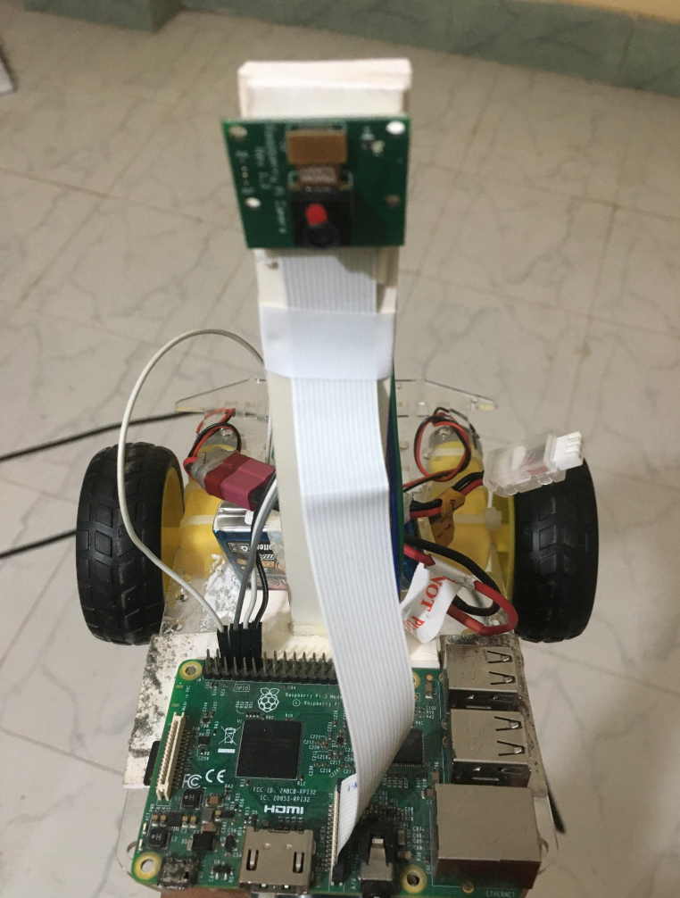
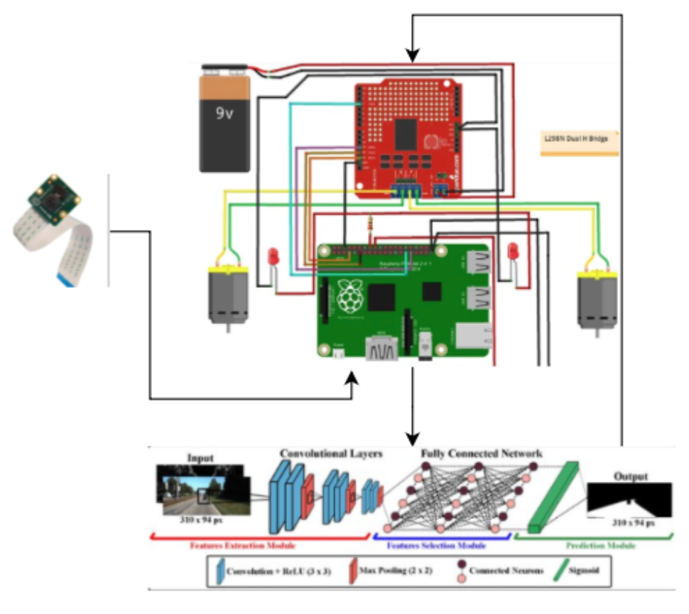
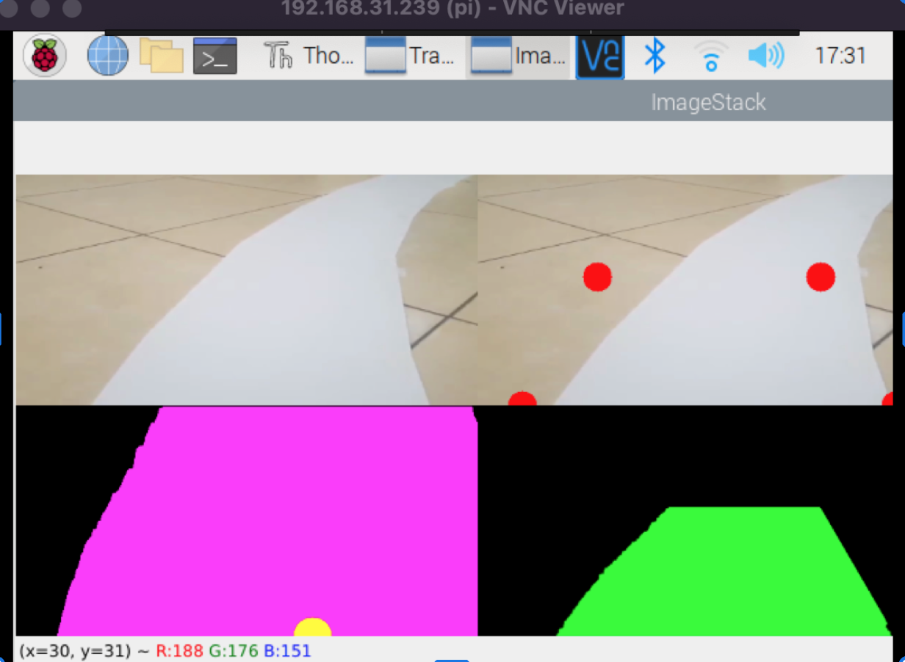

## Self Driving Car | Behavioural Cloning | Autonomous car

<b>Behavioral cloning for autonomous cars involves training a machine learning model to mimic the behavior of a human driver, using data collected from that driver's real-world driving experiences.</b>

<h2>🚀 Hardware Setup</h2>

<h3>🔧 Components Used</h3>
<ul>
  <li>Raspberry Pi</li>
  <li>Pi Camera</li>
  <li>Motor Controller (L298N Dual H Bridge)</li>
  <li>Power Controller (9V Battery or equivalent)</li>
</ul>

<h3>⚠️ Most Challenging Parts</h3>
<ul>
  <li>Managing hardware parts and Raspberry Pi GPIO initialization</li>
  <li>Motor controller connection and configuration</li>
  <li>Setting up and accessing the Pi Camera</li>
  <li>Load ML model </li>
</ul>

<h3>📷 Circuit Diagram</h3>

The following diagram shows the complete connection between Raspberry Pi, motor controller, power supply, and camera:

<h2>🚀 Software Setup</h2>

Lane Detection
Behavioral cloning for autonomous cars, as it enables the vehicle to accurately track the lanes on the road and adjust its behavior accordingly.

<ul>
  <li>Train ML model from driving experience data (Collected through keyboard/joystick)</code></li>
  <li>Load ML model on raspberry pi</li>
  <li>Predict Decision from Model for moving (left,right,stop,speed) and control the motor</li>
</ul>

<h3>🧠 ML Model Overview</h3>

The ML model used here is a convolutional neural network (CNN) that takes image frames as input, extracts features, and predicts lane positions. It includes:

<ul>
  <li>Input Image (320 x 240 px)</li>
  <li>Convolutional Layers with ReLU and Max Pooling</li>
  <li>Fully Connected Network for final prediction</li>
</ul>
This features includes :
Image Processing 
CNN (Nvidia)  Model provided by audacity

